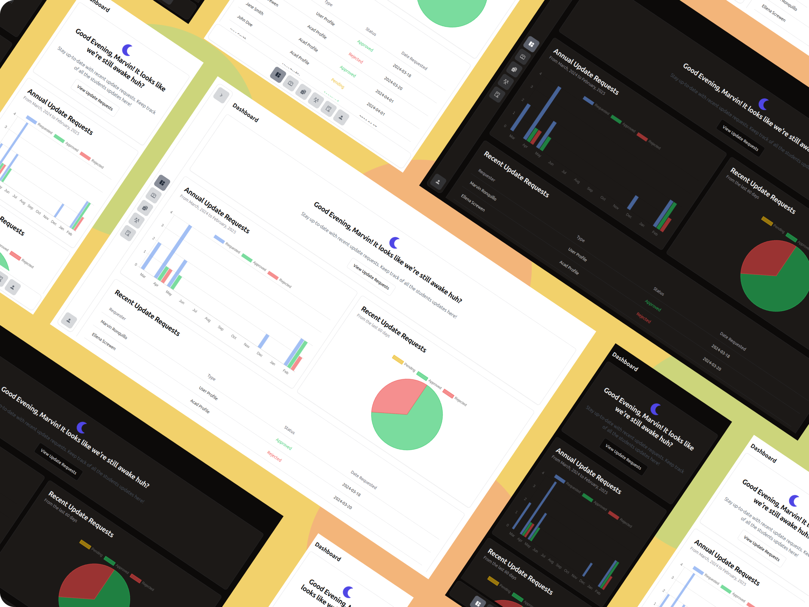

# Information Update Tracking System

This system would allow the college administration to track and manage updates to student personal information in real-time. It ensures that the college always has accurate data and can track changes such as contact information, addresses, and emergency contacts. The system would also ensure students regularly update their details and notify the administration when these updates occur.

## Key Features:

1. Student Information Portal – A web-based interface where students can log in and update their personal information (contact numbers, home address, emergency contacts, etc.).
2. Update Monitoring Dashboard – An admin panel where college staff can monitor and review all updates made by students.
3. Data Change Notifications – Automated email or SMS alerts to college staff when critical changes (e.g., new address) are made.
4. Periodic Update Reminders – Automatically send reminders to students to review and update their personal information at regular intervals (e.g., every semester).
5. Audit Logs – Maintain a history of all changes made to student records, with details on what was changed and when.
6. Reporting and Analytics – Display update requests analytics on dashboard.
7. Data Validation – Allow the administration to review and approve certain updates, ensuring that only valid information is accepted.
8. Security and Privacy – Use secure protocols to protect sensitive student data, with role-based access control for administrative users.

# Technologies Used:

- Node.js
- React
- MongoDB
- Express
- JWT
- Nodemailer
- Mongoose
- Tailwind CSS
- Vite
- Typescript
- Zod
- Shadcn UI

# License

This project is licensed under the [MIT License](LICENSE).
